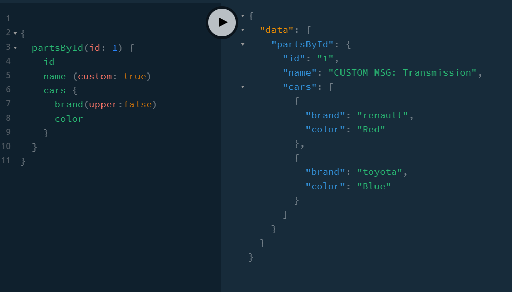

### Exercise

We can do the same for Parts:name as follows...



If a variable of custom: true is passed then add 'CUSTOM MSG:'

```
	Part: {
		name: (parent, args, context, info) => {
			console.log('Part > name', parent.id);
			if (parts.filter((part) => part.id == parent.id)[0]) {
				return 'CUSTOM MSG: ' + parts.filter((part) => part.id == parent.id)[0].name;
			}
			return null;
		},

	}
```
