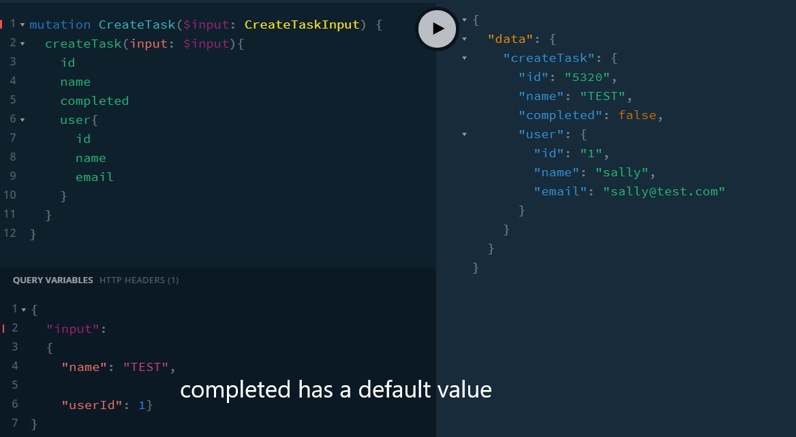

## TOP

[SERVER09](#SERVER09)

## SERVER01

[TOP](#TOP)

## SERVER02

Set up Users and Tasks.

Return all tasks or all users.

Cannot resolve tasks when a child of users.

```
query GetAllUsersTasks {
  allUsers: users {
    id
    name
    email
    tasks{
      id
      name
      completed
    }
  }
}
```

[TOP](#TOP)

## SERVER03

We can now resolve Tasks

```
{ # now works as we have field resolvers
  tasks {
    id
    name
    user {
      id
      name
      email
    }
  }
}
```

### LAB:

Uncomment Task.name to see how we can overwrite previous Task.name

Task.user can also be overwritten provide the shape is as per schema.

Note order of all tasks then resolve name then resolve subquery.

There is a resolving chain of Query > Tasks.

[TOP](#TOP)

## SERVER04

getTaskById query

```
{
  getTaskById(id: 1) {
    id
    name
    completed
    user{
      id
      name
      email
    }
  }
}

```

Same for users. If one has a function in Schema.Query but not defined in resolves the app won't crash until that function is called.

ids are serialized to string type as shown in node terminal.

in client > 04-get-task-by-id.html we can use query and variables as well as aliases.

[TOP](#TOP)

## SERVER05

Create Users list with tasks.

[TOP](#TOP)

## SERVER06

Add createTask Mutation and input

New task store in memory not file.

Add mutation: Mutation to schema.

Use Query Variables tab.

In client HTML, the alias TaskCreated is used.



_06-add-task.html has client version._

[TOP](#TOP)
