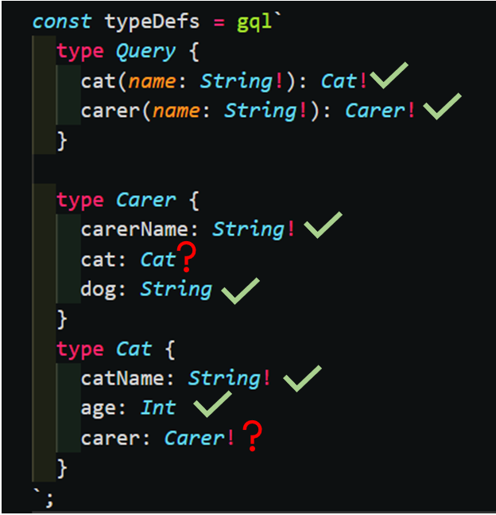
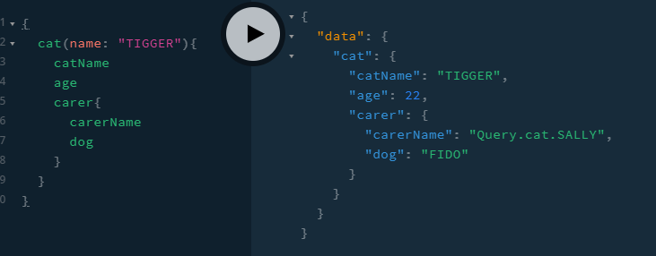
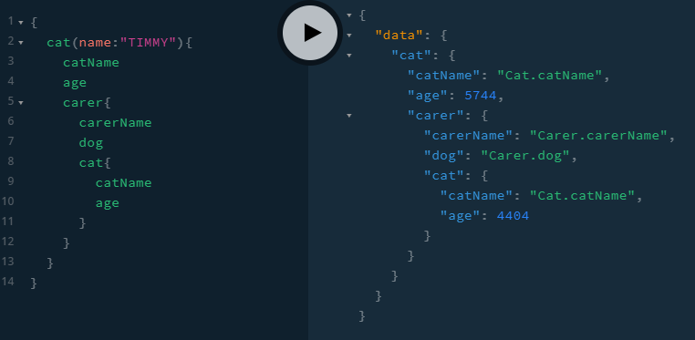
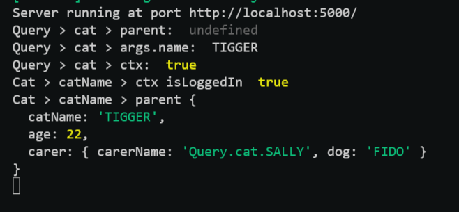

-  index01.js - no child resolution. Use of AST analysis.
-  index02.js - resolves Cat with Carer commented out
-  index03.js - resolves Cat and Carer with introduction to use of CONTEXT with AJAX to JSON-SERVER.

In our schema we have the following 'objects':

-  Query.cat
-  Query.carer
-  Carer.Cat
-  Cat.Carer
-  all the others resolve to SCALAR

When we run queries for Query.cat, it has no reference to Cat.Carer. It is like foreign keys and needs another table. The same is true of Carer.Cat.

index01.js has Query.cat and Query.carer

index02.js has Carer.cat and Cat.carer

If we have Schema.Query.cat then this is resolved first.

We can also have Schema.Query.Cat.catName that will then overwrite the Schema.Query.cat.catName.

It is a bit like CSS where last rule trumps others.

Being a Graph, GQL knows all the interconnections.

-  You can either copy and paste index0X into index.js
-  Change package.json to use index0x
-  Use node index0x.js

Use to show how resolution passes down

### index01 has basic Query.cat

### index02 has a CAT type at root of schema that can be used to resolve its fields.

We see the parent argument in action as we can pass down values from the cat resolver. Normally an empty object is passed down and we let the top level Cat type resolve all the fields.

Thus we can have access to parent as the first argument passed.

As a GRAPH, all nodes are connected and GQL knows the whole graph/tree.

### index03 has CAT and CARER resolution as well as intro to CONTEXT using AJAX to get User data.
