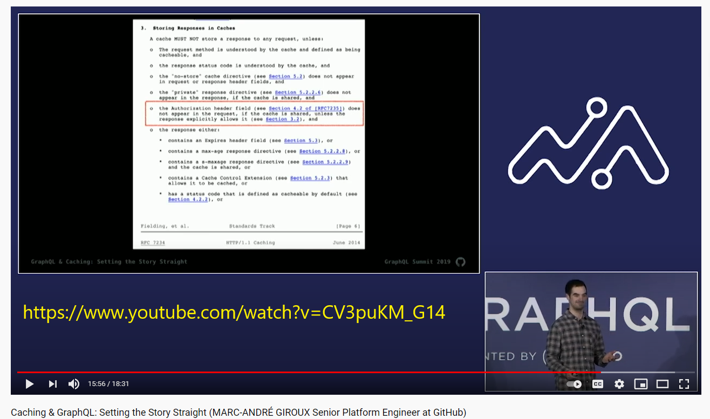

# 40-caching

https://www.apollographql.com/docs/apollo-server/data/data-sources/

https://www.youtube.com/watch?v=CV3puKM_G14 - debunks myths form REST advocates about GraphQL.

https://www.w3.org/Protocols/rfc2616/rfc2616.html

GraphQL aims to let each field resovler do its look up.

The reason is that the client may not ask for some fields and if we did the complete look up at the Query type level this would be overfetching and unnecessary DB work.

This however causes the N+1 problem.

For every 1 database query that returns N results, you will need to make N additional queries

If we have a user with 10 tasks then we have 1 query to get user and then 10 queries to get details on all their tasks.

If we want a user and all their tasks, we have a number of different strategies:

1. Do one main complete query, (an SQL join at DB level for example of user and all their tasks), and retrieve the complete data set regardless of whether the client requested these sub fields. However, when needed, this is very efficient as it is just one query.

2. Using Dataloader that was developed by FB, we can batch the 10 queries and do a SQL 'WHERE id IN '1,2,3,4,5...' and also cache queries by id . This is then 2 queries with results cached by id.

3. Hybrid. Analzye the info argument and determine if there is a need for many requests. If so use dataloading, if not using the SQL JOIN approach.

This is based an an excellent video on this matter by Ben Awad: https://www.youtube.com/watch?v=uCbFMZYQbxE

https://gajus.medium.com/using-dataloader-to-batch-requests-c345f4b23433

## Caching Directives

https://www.apollographql.com/docs/apollo-server/v2/performance/caching/
