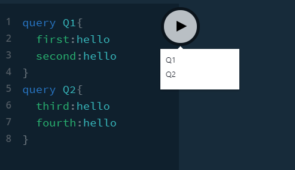
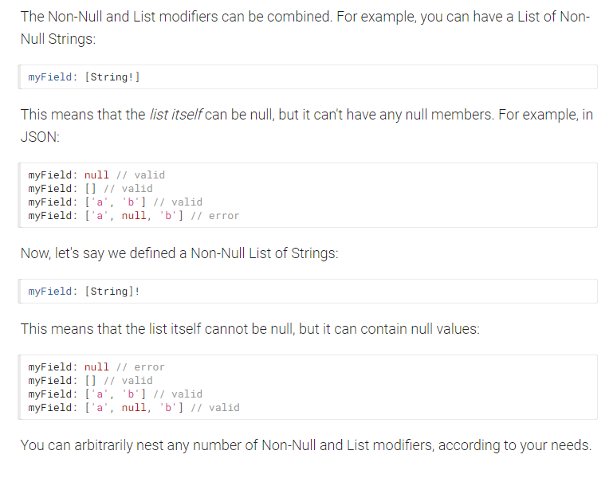

## TOP

## SERVER01

Server01.js is our basic set up. We use ApolloServer, a .env file to store port and supply the two essential parts for GQL - a schema and set of resolvers.

Let's look at the playground at http://localhost:5000/

-  Send back null for hello and it works. Difference if required is used.
-  See response in NETWORK TAB - always 200 even if GQL returns error, shown by sending null when String!
-  Remove all resolvers and it works.
-  test(x: Int) has optional argument. use test(x: Int!) and see difference with no argument
-  Use getError() to show we still get 200. If there is error on way to API then on emay get 400s etc.



-  CTRL + ENTER in one query will fire that...or else play button will show two queries...
-  use of aliases to shape data returned.

```
query Q1{
  first:hello
  second:hello
}
query Q2{
  third:hello
  fourth:hello
}
```

Add in ME

-  One can change shape of returned data with aliases at field level:

```
query {
  me {
    id
    mainSkill:stack
  }
}

```



-  Difference of lists and ! with data...['a','b', null], null, []etc
-  use of Me return type and how that works.
-  'api' shows how we can use GraphQL as wrapper around our API. (In Auth we will see how we can pass on headers to API to do Auth).

## Settings:

-  One can rename tabs which default to query.
-  Polling by default every 2 seconds.
-  One can change format etc.

## Client HTML example

-  We will see this later.

## Server01 Exercises

-  Make Me have more fields.

-  Return various list types.

[TOP](#TOP)

## SERVER02

Use of comments and how to insert those comments into docs at Type and Field level.

Set up Students and Projects.

Return all projects and students.

Breaks when wanting user sub query. We need to have a foreigh key type appraach. Note we could resolve all the data in the resolver but that would cause overfetching when the query does not ask for user details rather. It is best to let each field and type do their own resolving.

We can have a linked query but if the fields in Project are required it will error. Remove ! on Project type and it will not break.

```
query Students{
  students{
    id
    firstName:name
    projects{
      id
      name
      completed
    }
  }
}
```

[TOP](#TOP)

## SERVER03

```
{
  projects {
    id
    name
    completed
  }
}
```

We can overwrite project.name with a resolver for name - uncomment out:

```
Project: {
		name: () => {
			console.log(`---> Project.name returning TEST Project ${Math.floor(Math.random() * 100000 + 100000)}`);
			return `TEST Project - ${Math.floor(Math.random() * 100000 + 100000)}`;
		},
	},
```

## Server03 Exercise

-  make student name uppercase

[TOP](#TOP)

## SERVER04

We can now resolve child projects when we carry out the following query:

```
{
  students {
    id
    name
    projects {
      id
      name
      completed
    }
  }
}

```

Same for students. If one has a function in Schema.Query but not defined in resolvers the app won't crash until that function is called.

ids are serialized to string type.

client > 04-get-project-by-id.html to see HTML client view.

[TOP](#TOP)

## SERVER05

Add createProject Mutation and create type input.

New project store in memory not file.

Add mutation: Mutation to schema.

Use Query Variables tab.

In client HTML, the alias ProjectCreated is used.

## Server05 Exercise

-  add a student in same way as we added a project but use all fields as mandatory except projects.


_05-add-project.html has client version._

lets go to cars-parts

Lets go to COURSE-03 for 15-leaf where we will go through this parent-child relationship again and in more detail.

[TOP](#TOP)

[TOP](#TOP)

## SERVER07

## SERVER08

## SERVER09

[TOP](#TOP)
