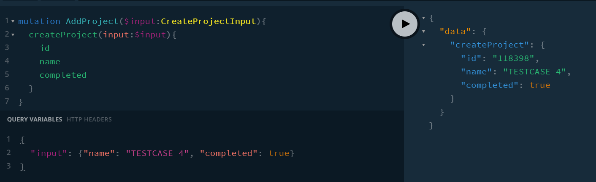

## TOC

-  Server00 - Base set up with hello()
-  Server01 - a lab to try out schema and resolvers and get to know playground.
-  Server02 - use some in memory data for students and projects. show HTML query.
-  Server03 - enable Projects type in Students type to be resolved but not a real database structure.
-  Server04 - enable queries by id for students and projects but not able to resolve linked types.
-  cars-parts - used to show resolving.
-  Server05 - Basic add project mutation
-  Server06 - Mutation (CRUD) for a project wint input type and use in HTML query.

## SERVER00

A base version to show minimal requirements before we use Server01 as a LAB.

## Settings:

-  One can rename tabs which default to query.
-  Polling by default every 2 seconds.
-  One can change format etc.

[TOP](#TOC)

## SERVER01

Server01.js is our basic set up. We use ApolloServer, a .env file to store port and supply the two essential parts for GQL - a schema and set of resolvers.

Let's look at the playground at http://localhost:5000/

-  Send back null for hello and it works. Difference if required is used.
-  See response in NETWORK TAB - always 200 even if GQL returns error, shown by sending null when String!
-  Remove all resolvers and it works.
-  test(x: Int) has optional argument. use test(x: Int!) and see difference with no argument
-  Use getError() to show we still get 200. If there is error on way to API then on emay get 400s etc.
-  lists and hello can have loose type coercion


-  CTRL + ENTER in one query will fire that...or else play button will show two queries...
-  use of aliases to shape data returned.

```
query Q1{
  first:hello
  second:hello
}
query Q2{
  third:hello
  fourth:hello
}
```

Add in ME

-  One can change shape of returned data with aliases at field level:

```
query {
  me {
    id
    mainSkill:stack
  }
}

```


-  Difference of lists and ! with data...['a','b', null], null, []etc
-  use of Me return type and how that works.
-  'api' shows how we can use GraphQL as wrapper around our API. (In Auth we will see how we can pass on headers to API to do Auth).

## Settings:

-  One can rename tabs which default to query.
-  Polling by default every 2 seconds.
-  One can change format etc.

## Client HTML example

-  We will see this later.

## Server01 Exercises

-  Make Me have more fields.

-  Return various list types.

[TOP](#TOC)

## SERVER02

Use of comments and how to insert those comments into docs at Type and Field level.

Set up Students and Projects.

Return all projects and students.

Breaks when wanting user sub query. We need to have a foreign key type appraach. Note we could resolve all the data in the resolver but that would cause overfetching when the query does not ask for user details rather. It is best to let each field and type do their own resolving.

We can have a linked query but if the fields in Project are required it will error. Remove ! on Project type and it will not break.

```
query Students{
  students{
    id
    firstName:name
    projects{
      id
      name
      completed
    }
  }
}
```

[TOP](#TOC)

## SERVER03

As it stands, GraphQL cannot resolve Student.projects.

```
query{
  students{
    id
    name
    email
    projects{
      id
    }
  }
}
```

will cause error

If we replace Student > projects to [Int] then it can output this scalar type.

```
query{
  students{
    id
    name
    email
    projects
  }
}
```

will give back a list which is a scalar type.

If we add in the root level Project with Student > projects as [Project] then it will return what we put into the resolver.

We are not querying Projects to get data at this stage but learning how resolvers work.

We can overwrite project.name with a resolver for name - uncomment out:

If we request id it will return null unless we have id: ID! in which case a non-null error will be returned.

```
	Project: {
		id: () => {
			return 100;
		},
		name: () => {
			console.log(`---> Project.name returning TEST Project ${Math.floor(Math.random() * 100000 + 100000)}`);
			return `TEST Project - ${Math.floor(Math.random() * 100000 + 100000)}`;
		},
		completed: () => true,
	},
```

If any of these fields do not have a resolver then null is returned unless the type Project has it as a required field.

We can now resolve child projects when we carry out the following query:

```
{
  students {
    id
    name
    projects {
      id
      name
      completed
    }
  }
}

```

[TOP](#TOC)

## SERVER04

Same for students. If one has a function in Schema.Query but not defined in resolvers the app won't crash until that function is called.

ids are serialized to string type.


client > 04-get-project-by-id.html to see HTML client view.

We can now pass in variables via Query Variables rather than hard coding them.


## cars-parts

We can see the generic linked resolution for many to many relationships as well as see how DDOS could occur.

There is an exercise to pass a variable inthe Parts type to add a custommessage.

We will see this again with more detail in COURSE-03 for 15-leaf where we will go through this parent-child relationship again and in more detail.

[TOP](#TOC)

## SERVER05

A basic way of creating a new project.


Mutations with input type.

## SERVER06

We remove resolver > Project as this is not part of the lesson and was used to demonstrate something that is not consistent with the project.

Add createProject Mutation and create type input.

Change the return type from string to type Project.

New project store in memory not file.

Add mutation: Mutation to schema.

Use Query Variables tab.

In client HTML, the alias ProjectCreated is used.
We now create a Mutation which can accept input values and create mutations on the server - create, update or delete depending on the resolver.



Whilst we could do this with a query, it is good practice to call it a mutation in the same way in REST we can do mutations with GET.

_06-add-project.html has client version._

Note, queries run in parallel, mutations run sequenitallys...


[TOP](#TOC)

In COURSE-01, we have seen:

-  how to use a SCHEMA and RESOLVER to implement GraphQL.
-  how to resolve linked types (student and projects).
-  we have been able to do queries by id.
-  we have done mutations to send data to GraphQL and the resolver can then do CRUD.
-  we have seen how to make client requests for queries or mutatations with custom data.

Thus, we have implemented a CRUD GraphQL server doing all that our REST API would do.

[TOP](#TOP)
