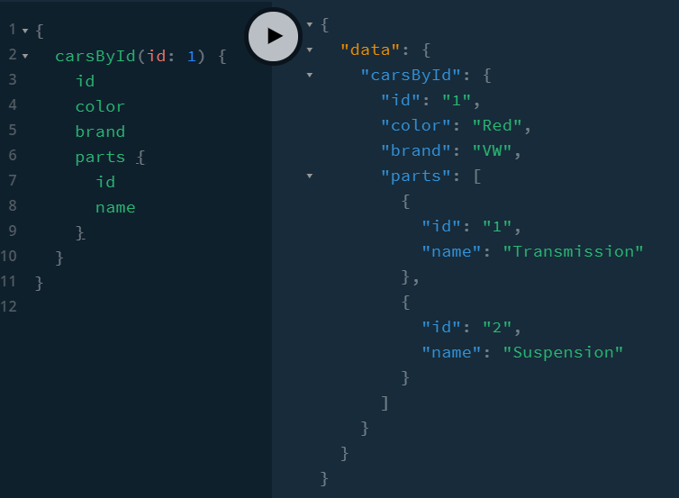
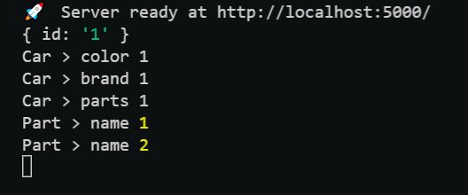
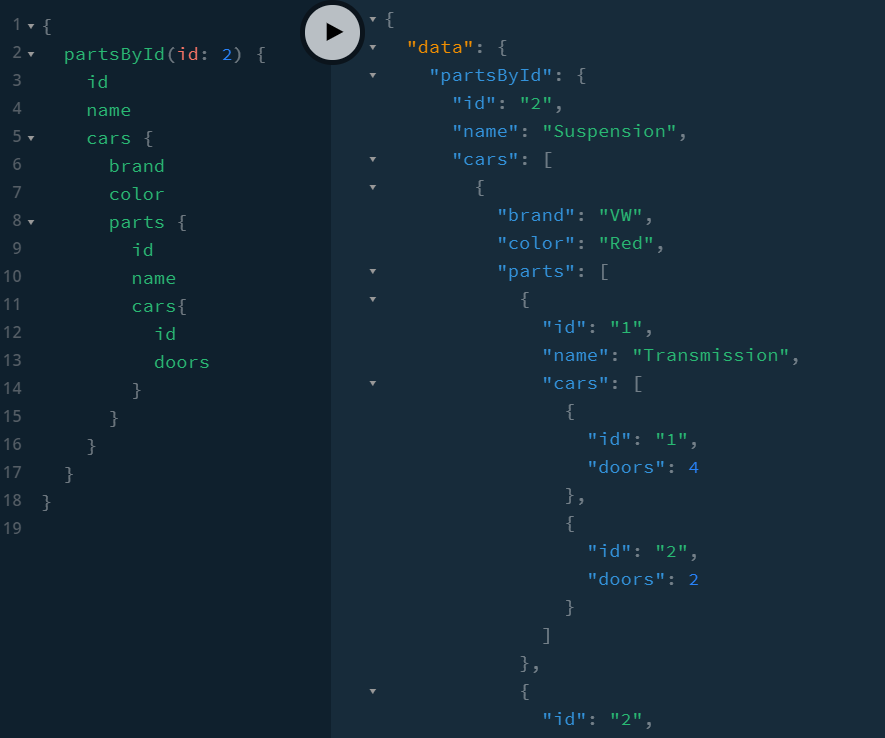
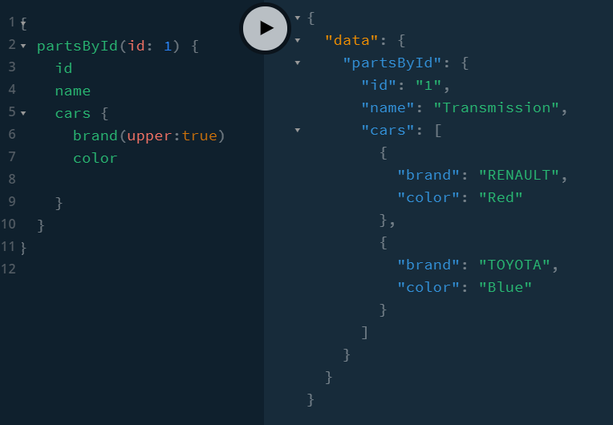

When we run carsById, it returns a Car.

The first resolver just gives the args, i.e. id=2 and to resolve Car, it works its way down the graph to Car and finds all the relavant fields.

When it comes to parts, parts returns a list of Part types, so it has to go to Parts and resolve fields there.

If one removes Cars > brand or replaces the return with some other text, it will appear in data returned.

As brand is a required field, if the brand resolver is removed the query will error.

If one makes brand not required, the query will return the default null.

One can keep drilling and lead to a DDOS attack. We will look at how we can prevent this in COURSES-03 > 50-limit-ddos

### INDEX02 - customising output

We can also add field level variables. These are not input type variables as in mutations.

These must be added in the schema and then resolves as one wishes in the resolver using the args to see what has been requested.

We can make an optional upper variable on brand to return uppercase brand. We have made it optional so it does not need to be added in the query.

So we can see that all these resolvers are individual functions and our query is a list of functions with or wothout variables that get resolved and appended together.
