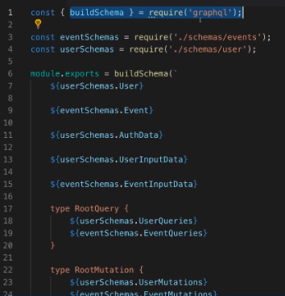
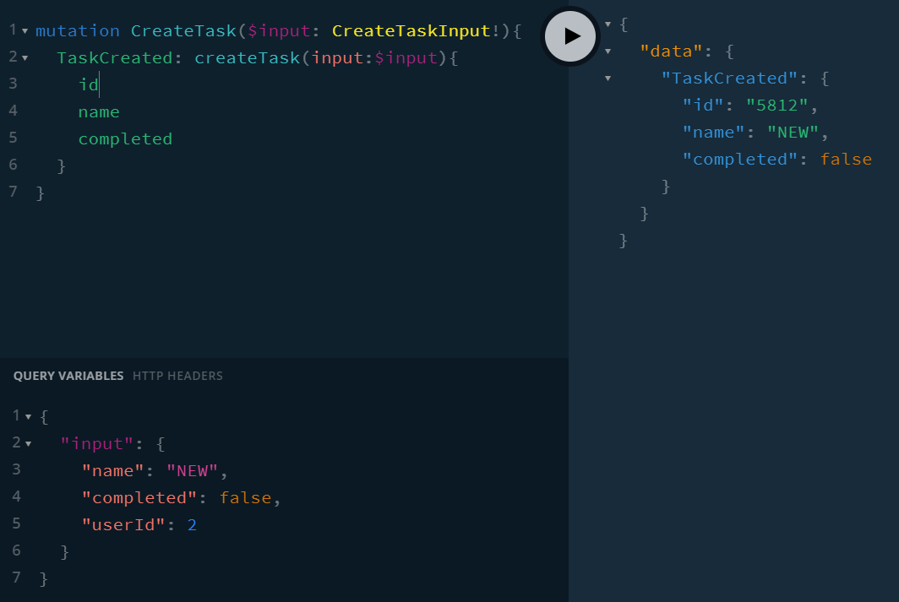

## TOP

Schema and Resolver modularisation

https://www.apollographql.com/blog/backend/schema-design/modularizing-your-graphql-schema-code/

https://www.graphql-tools.com/docs/schema-stitching/#basic-example



## SERVER01

This is server06 from V1

[TOP](#TOP)

## SERVER02

Move resolvers to own folder.

[TOP](#TOP)

## SERVER03

We do schema stitchingmerging using a simple strategy.

For more involved ways with tools:

https://www.graphql-tools.com/docs/schema-merging

There can only be one root Query.

We can extend type User but we can not have an empty base or extend type, so we use a placeholder \_: String to prevent error.
[TOP](#TOP)

## SERVER04

getTaskById query

```
{
  getTaskById(id: 1) {
    id
    name
    completed
    user{
      id
      name
      email
    }
  }
}

```

Same for users. If one has a function in Schema.Query but not defined in resolves the app won't crash until that function is called.

ids are serialized to string type.

[TOP](#TOP)

## SERVER05

Create Users list with tasks.

[TOP](#TOP)

## SERVER06

Add createTask Mutation and create type input.

New task store in memory not file.

Add mutation: Mutation to schema.

Use Query Variables tab.

In client HTML, the alias TaskCreated is used.



_06-add-task.html has client version._

[TOP](#TOP)

[TOP](#TOP)

## SERVER07

## SERVER08

## SERVER09

[TOP](#TOP)
