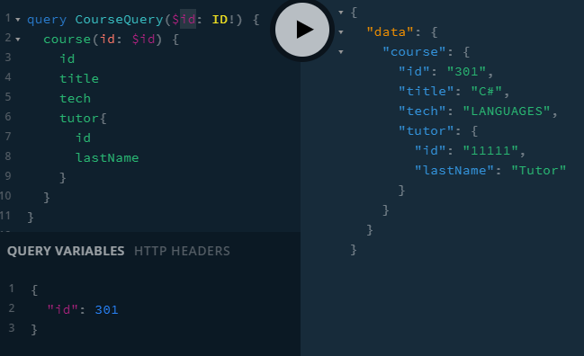

## Ensure JSON_Server is running to provide database.

## In server.js, use resolver0X and schema0X for each stage.

## 01 Student and Tutor Type

Add Students and Tutors.

We add in Tutor and Student

Use JSON Server to get Queries fulfilled for:

-  student(id)
-  students
-  tutor(id)
-  tutors

How do we handle lists []?

In general, a GraphQL list represents a sequence of values. It is possible to view these values as arrays (e.g. in Javascript), although the analogy is not completely precise. As we mentioned a list keeps items in order. In SDL the list modifier is written as square brackets with the wrapped instance of the type in the bracket. In our schema we used the list modifier to define that if we call the query users, it returns a sequence of types of User from the database.

[Int] A list of nullable integer values
[Int!] A list of non-nullable integer values. Null can be returned but if it contains items they must be Int and not null. Can be empty.
[Int]! A list must be returned but it can have null values
[Int!]! A list must be returned and if there are items then must be Int and cannot be null.

[Int] is informative - the type is meant to be Int
[Int!] means that items are required and must be of type Int.

We can treat the list in the same way.
[] means that a list is meant to be returned but null is OK.
[]! means that a list must be returned otherwise an error will be returned.


## 02 Passing resolution to LEAF for Course

As it stands, we can get Courses back but no details on Tutor as there is no resolver for it.

```
const Course = {
	// course is the parent object
	tutor: (course, args, ctx, info) => {
		console.log('Course parent having Course.tutpor resolved', course);
		return { id: '11111', firstName: 'A', lastName: 'Tutor', email: 'x@test.com' };
	},
};
```

By adding the above, when GQL sees that on a Course the tutor: Tutor, it can then resolve tutor.

Remember to export all new definitions like this along with Query and Mutation.



We have an example of a client posting this to the server. To help understanding what variables are what we use non id names where they are not required by the schema.

EX. Comment out Course in the resolver and remove it as an export and one gets null. With it one gets whatever is in the Course.tutor resolver.

## 03 Course Mutation

We add a Mutation to enter a Course. We can add fields inline or use and input type to make this easier.


```
type Mutation {
	createCourse(title: String, tech: String, tutorId: Int): ID
}
input CreateCourseInput {
	title: String
	description: String
}
```

We can give response an alias:


## 04 Using the input type.

Having lots of arguments can be tedious.

We can use the input type by rewriting the Mutation as follows:

```
type Mutation {
	createCourse(input: CreateCourseInput): ID
}
```

by always using input it makes writing Mutations easier as we do not need to know the parameter name.


04-add-course.html in client folder shows a client request.


### This shows us how we pass data from client to GQL.

newCourse will be an object with all the values.


## 05 Custom Directives

These can be used in client with the built in @skip and @include.

There is also graphql lodash which enable one to write powerful custom directives.


use server-directives.js with

```
{
  one: course(id:201) {
    id(message: "COURSE")
    title
    tech
    tutor {
      id(message: "TUTOR")
      lastName
    }
  }
  two: course(id: 301) {
    id(message: "COURSE")
    title
    tech
    tutor {
      id(message: "TUTOR")
      lastName
    }
  }
}
```
