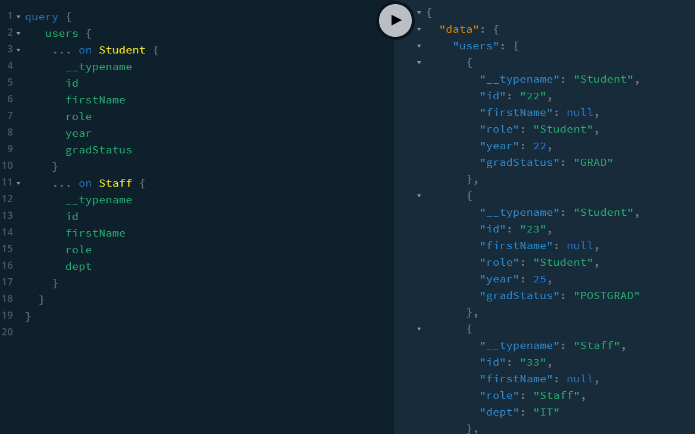

## 23-interface

### We need each type ot have at least one different field so that the Person type can be resolved to Staff or Student...

### Opportunity for fragments

https://www.apollographql.com/docs/apollo-server/schema/unions-interfaces/



Union: A collection of related but different objects

Interface: A collection of similar objects with most of their properties the same but some different ones too.

Interfaces allow us to group result into one query.

We have to copy all interface fields in the extended type.

It is not a labour saving method for the SERVER but for the CLIENT.

Furthermore, the definition of the interface might be in another file and would no necessarily know what the interface included.

It is an appropriate introduction of ENUMs:

````
	enum PersonType {
		Student
		Tutor
		Staff
	}
	enum GradStatus {
		UNDERGRAD
		GRAD
		POSTGRAD
	}
```
Enumeration types:

Also called Enums, enumeration types are a special kind of scalar that is restricted to a particular set of allowed values. This allows you to:

- Validate that any arguments of this type are one of the allowed values
- Communicate through the type system that a field will always be one of a finite set of values

When passing in as values in hard coded 'graphql' queries, use GRAD not 'GRAD' but return value from resolver needs to be 'GRAD'.

??? When passing in via Query tab or in client code, 'GRAD' will be needed. ?????

Query

We can use this to resolve Interface types if the names match up but it is really about being able to differentiate between types of interfaces.

In books.js we can also resolve by looking at a particular property of each type as follows:

```
	Book: {
		__resolveType(book, context, info) {
			if (book.courses) {
				return 'TEXTBOOK';
			}
			if (book.colors) {
				return 'COLORINGBOOK';
			}
			return null; // GraphQLError is thrown
		},
	},
	```
````
