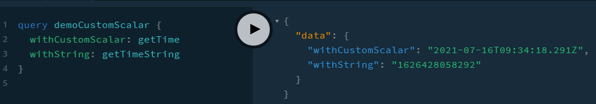

## 24-custom-scalar

https://www.apollographql.com/docs/apollo-server/schema/custom-scalars/



```
 query demoCustomScalar{
   withCustomScalar:getTime
   withString:getTimeString
 }
```

```
Query: {
  getTime: () => new Date(),
  getTimeString: () => new Date(),
  // new Date() will return integer "1625670968724" but our custom scalar converts this to ISO Date
},
```

Note how we can use aliases.
